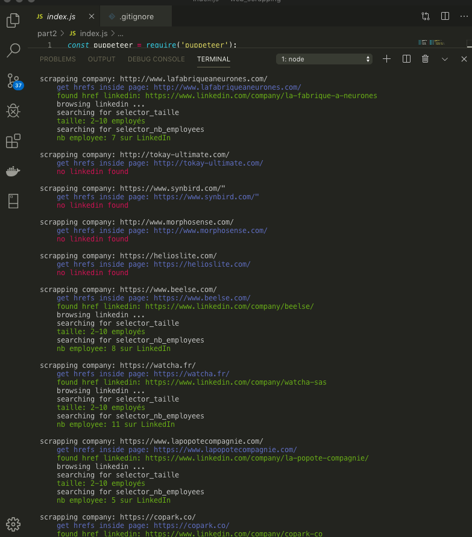

# web_scrapping
- project: LinkedIn web scrapping for M&A business dev
- input data: web page with 1000+ startups, see https://www.levillagebyca.com/fr/startups
- ouput data: excel file with company_name / site_url / linkedin_profile / number_of_employee info for each startup

## readings
### javascript stuff
- iterate through div inside html https://stackoverflow.com/questions/15843581/how-to-correctly-iterate-through-getelementsbyclassname
- parser and writer for various spreadsheet formats https://www.npmjs.com/package/xlsx-style
- fetch promise pending https://stackoverflow.com/questions/59394620/why-fetch-returns-promise-pending
- automating Login with Puppeteer https://www.youtube.com/watch?v=fr_fLEx_TdI
- networkidle2 config https://github.com/puppeteer/puppeteer/blob/main/docs/api.md#pagegotourl-options
- high-level API to run headless Chrome  https://github.com/puppeteer/puppeteer
- nice tut https://youtu.be/TzZ3YOUhCxo
- in details (fr) https://www.youtube.com/watch?v=tLIqYdKhwSc

### python stuff
- classes in python https://www.w3schools.com/python/python_classes.asp
- create excel file w/ python https://xlsxwriter.readthedocs.io/index.html

## results

